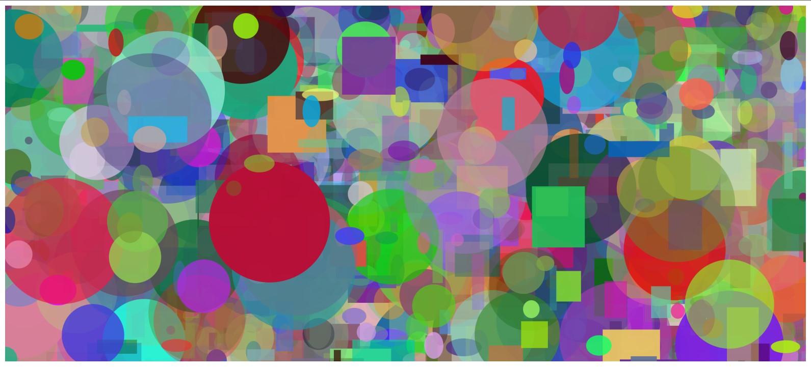
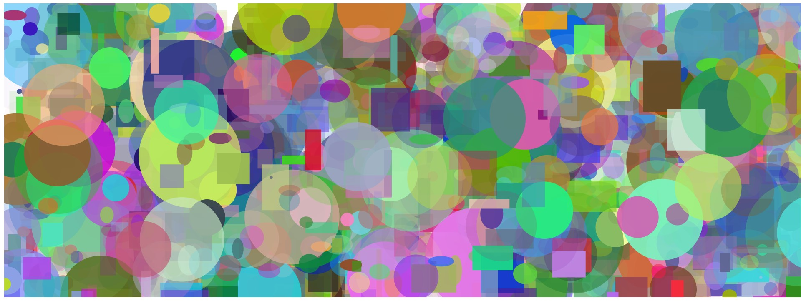
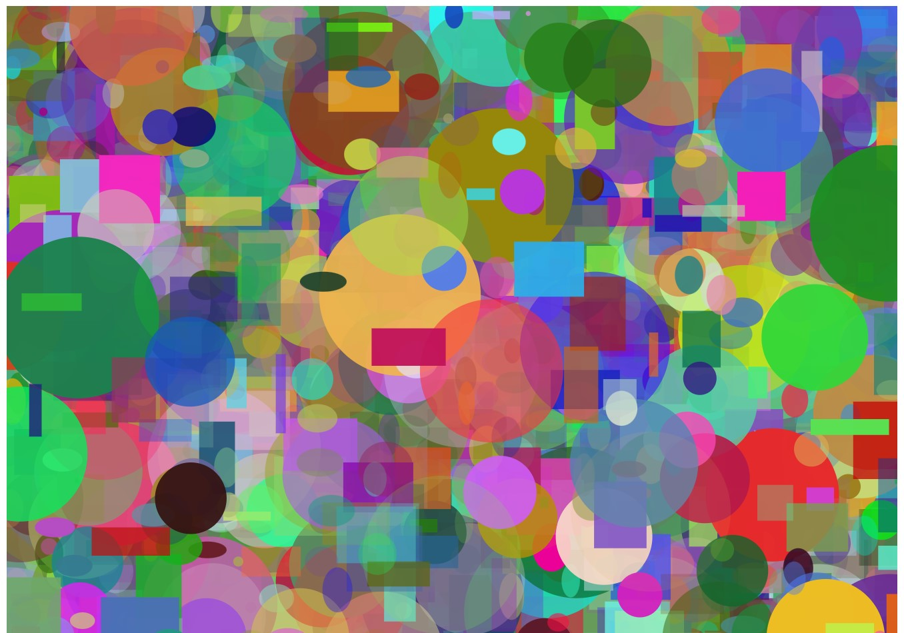

    <h1 style="font-size: 40px">Random Art Generator</h1>

## Description:

This project is a python - HTML integration as in we use python's file handling features to write HTML code. We also use python's Object Oriented Programming model to facilitate our process. Using OOP we make classes for different shapes (Circle, Rectangle, Ellipse, Square). We then use python's random function to create a population of all the shapes with random measurements and random colors and finally using python's file handling we add all those shapes into html svg tag and the result is a beautiful, colourful pattern of random shapes over the screen.

## Pattern Examples:

 

 

 

